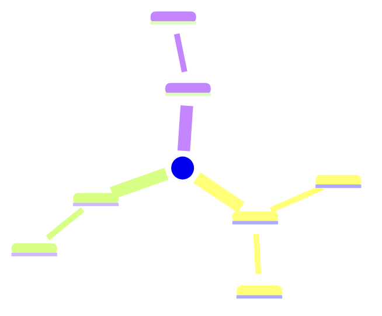
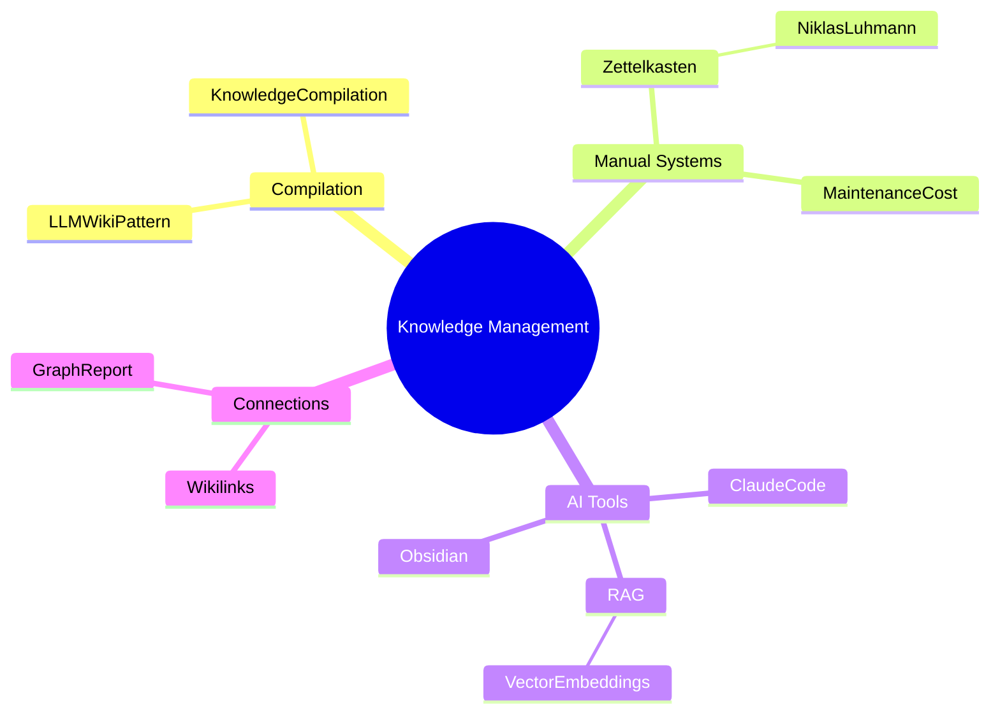

# Skill: mind map — /mindmap <topic>

## Triggers
- "mindmap <topic>" or "mind map <topic>"
- "map out <topic>"
- "show me a map of <topic>"
- "visualise <topic>"

## What This Does

Generates a focused Mermaid `mindmap` diagram for a specific topic,
pulling from all relevant wiki pages. Obsidian renders Mermaid natively —
open the output file in Obsidian to see the visual.

Saves to `reports/mindmap-<topic>.md`.

---

## Steps

### 1. Find relevant wiki pages

Search wiki/concepts/, wiki/tools/ for pages related to the topic:
- Direct name match
- Tag match
- Pages that wikilink to or from the closest matching page
- Pages in the same cluster

Collect up to 20 relevant pages.

### 2. Identify the central node

The root of the mindmap is the topic itself (or the closest wiki page).
First-level branches = direct `[[wikilinks]]` from the root page.
Second-level branches = pages linked from those first-level pages (that are also in scope).

### 3. Categorise branches

Group branches by their relationship type:
- `supports` / `part_of` → structural children (solid branch)
- `contrasts_with` / `contradicts` → tension branches (label clearly)
- `created_by` / `used_in` → context branches
- `leads_to` → sequence branches

### 4. Write the mindmap file

Save to `reports/mindmap-<slug>.md`:

````markdown
---
title: "Mind Map — <Topic>"
topic: <topic>
date: YYYY-MM-DD
type: mindmap
wiki_pages: N
---

# Mind Map — <Topic>

> Generated from N wiki pages · Open in Obsidian to render



## Pages included
[list of wiki pages pulled into this map, with one-line descriptions]

## Pages not yet in wiki
[topics that appeared in the map scope but have no wiki page — ingest candidates]
````

### 5. Mermaid syntax rules

- Root: `root((Topic Name))` — double parens = circle
- First level: 2-space indent, plain text
- Second level: 4-space indent
- Keep labels short — max 4 words per node
- For long concept names, abbreviate: "Knowledge Compilation" → "KnowledgeCompile"
- No special characters in node labels (no brackets, slashes, apostrophes)
- Max 25 nodes total — prune to most important if scope is large

### 6. Confirm

```
🗺️  Mind map → reports/mindmap-<topic>.md
  Topic: <topic>
  Nodes: N  (N wiki pages)
  Open in Obsidian to view the diagram
  Missing pages flagged: N
```

---

## Example output (for topic "knowledge management")


